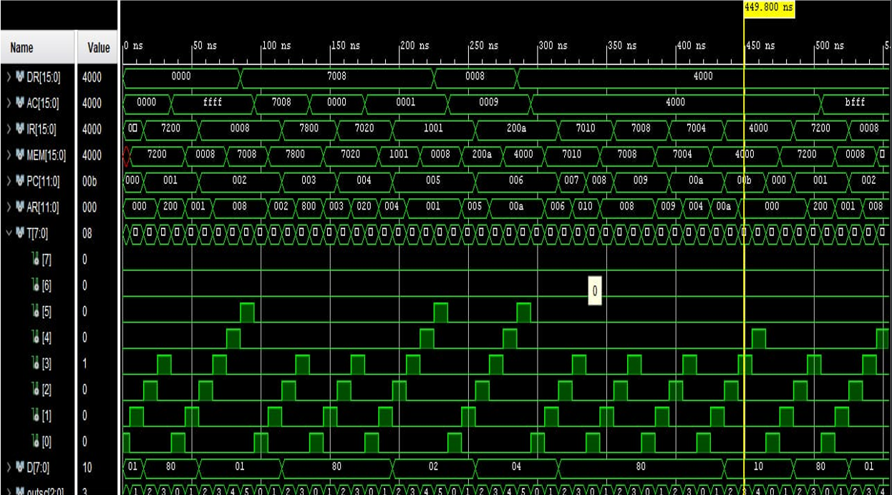

# Mano Basic Computer

## Overview
The Mano Basic Computer is a theoretical computer architecture described by **M. Morris Mano**. It includes a central processing unit (CPU), random access memory (RAM), and an input-output bus. This project was undertaken by a team of 5 students as part of our **Microcontrollers Architecture Course**.

---

## Modules

The project includes the following modules:

1. **4bit_counter**: Module for a 4-bit counter.
2. **256_RAM**: Module for a 256-byte Random Access Memory (RAM).
3. **AC_adderNlogic**: Module for an Arithmetic and Logic Unit (ALU) adder and logic operations.
4. **AC_CONTROL**: Module for controlling the Arithmetic and Logic Unit (ALU).
5. **AC_REG**: Module for the Arithmetic and Logic Unit (ALU) register.
6. **AR_Control**: Module for controlling the Address Register (AR).
7. **BUS_Control**: Module for controlling the system bus.
8. **BUS_Selection**: Module for selecting signals on the bus.
9. **Control_Unit**: Module for the main control unit.
10. **D_ff_reset**: Module for a D flip-flop with reset functionality.
11. **D_flipflop**: Module for a D flip-flop.
12. **decoder**: Module for a binary decoder.
13. **Decoder3x8**: Module for a 3x8 binary decoder.
14. **DR_Control**: Module for controlling the Data Register (DR).
15. **DR_REG**: Module for the Data Register (DR).
16. **Encoder8x3**: Module for an 8x3 binary encoder.
17. **main**: Main module.
18. **Main_tb_behav.wcfg**: Module for the testbench behavior configuration.
19. **mano_basic_comp3**: Module for the Mano Basic Computer.
20. **Memory_control**: Module for controlling memory operations.
21. **MUX8x3**: Module for an 8x3 multiplexer.
22. **PC_Control**: Module for controlling the Program Counter (PC).
23. **PC_REG**: Module for the Program Counter (PC) register.
24. **seq_counter**: Module for a sequential counter.
25. **Sequence_counter**: Module for a sequence counter.
26. **timing_signals**: Module for timing signals.

---
## Basic Computer

## Instruction Set

## Output

